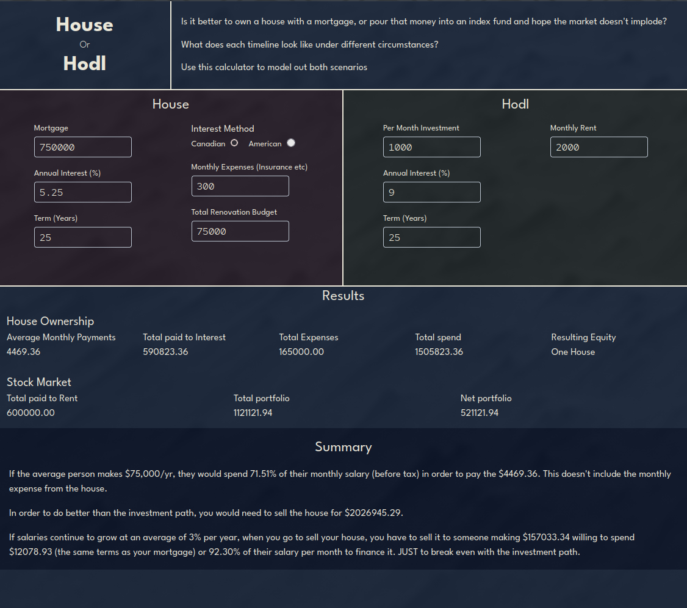

# House or Hodl
This is a simple calculator to compare owning a house with just dumping money into an index fund.

It was meant to be a quick and easy project to help me learn Dioxus and Rust and was pretty fun. I intended to do all the math numerically as opposed to analytically so that I could add a lot of nuance to the simulators, but it just got too depressing seeing how the actual numbers play out. I initially thought they might even out, but the depresssing fact is that median salaries are increasing at such a tiny rate compared to the housing market or stock market, the idea that you're going to be able to sell in the future at a comparable rate is crazy.

## How to Run
``` bash
git clone https://github.com/SGumbles/house_or_hodl.git
cd house_or_hodl
dx serve
```
You should be able to navigate to http://127.0.0.1:8080 and it will be there

## Future improvements
I'd like to change the fields in the Summary section so the user can enter different median salaries and salary growth rates. I also intended to add some charts to show how both scenarios play out over time.

